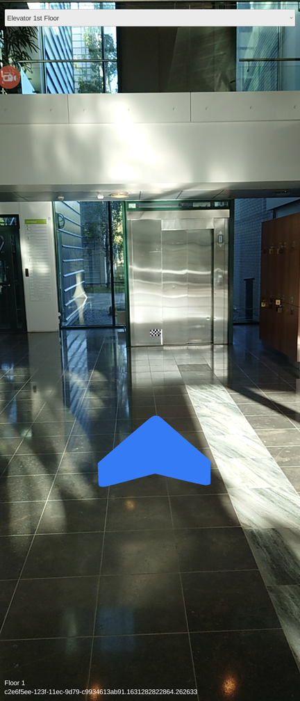

# IndoorAtlas Unity Plugin

[IndoorAtlas](https://www.indooratlas.com/) provides a unique Platform-as-a-Service (PaaS) solution that runs a disruptive geomagnetic positioning in its full-stack hybrid technology for accurately pinpointing a location inside a building. The IndoorAtlas SDK enables app developers to use high-accuracy indoor positioning in venues that have been fingerprinted.

Getting started requires you to set up a free developer account and fingerprint your indoor venue using the [IndoorAtlas MapCreator 2](https://play.google.com/store/apps/details?id=com.indooratlas.android.apps.jaywalker).

## Getting Started

* Set up your [free developer account](https://app.indooratlas.com) in the IndoorAtlas developer portal. Help with getting started is available in the [Quick Start Guide](http://docs.indooratlas.com/quick-start-guide.html).
* To enable IndoorAtlas indoor positioning in a venue, the venue needs to be fingerprinted with the [IndoorAtlas MapCreator 2](https://play.google.com/store/apps/details?id=com.indooratlas.android.apps.jaywalker) tool.
* To start developing your own app, create an [API key](https://app.indooratlas.com/apps).
* An example Unity project is included in the example folder.

It's recommended you use Unity version 2021.3.17f1 or higher.

## How to Use

* IndoorAtlas API key and secret. You can generate credentials from [our website](https://app.indooratlas.com/apps).

## Example

There's an example Unity project which implements basic AR wayfinding functionality using the `IndoorAtlas AR Wayfinding` component.
To build and run it on a real device, you may have to change the bundle identifier field in the Player Settings and fill
your IndoorAtlas credentials to `IndoorAtlas Session` component.

NOTE: For the AR functionality you will need a API key with AR support enabled. Please contact IndoorAtlas sales for this!



## Scripting

There is a `IndoorAtlasApi.cs` included that wraps most of our Android and iOS SDK functionality to C#.
You may use this api in your own components. To get callbacks from the Android and iOS SDK, your component should be children of `IndoorAtlas Session` component,
and implement onei or more of the following methods:

* IndoorAtlasOnLocationChanged
* IndoorAtlasOnStatusChanged
* IndoorAtlasOnHeadingChanged
* IndoorAtlasOnOrientationChanged
* IndoorAtlasOnEnterRegion
* IndoorAtlasOnExitRegion
* IndoorAtlasOnRoute

To get better idea of how these callbacks work and what are their arguments, check the `IndoorAtlasSession.cs` source file.

### Coodinate systems

This repository contains `WGSConversion` class (in `IndoorAtlasWGSConversion.cs` file) which can be used to convert IndoorAtlas SDK's (latitude, longitude) coordinates to metric (east, north) coordinates.

#### A numerical example

Set first a fixed point ("origin") to your 3D scene with `setOrigin` method, for example:

```C#
IndoorAtlas.WGSConversion temp = new IndoorAtlas.WGSConversion ();
temp.setOrigin (63.357219, 27.403592);
```

Relative (east, north) transitions can be computed with `WGStoEN` method after the origin has been set, for example:
```C#
Vector2 eastNorth = temp.WGStoEN (63.357860, 27.402245);
Debug.Log ("East-North transition: " + eastNorth.x + ", " + eastNorth.y);
```

This gives a transition of (-67.42091, 71.45055) _from origin_, that is, a transition of ~67 meters to west and ~71 meters to north _from origin_.

## License

Copyright 2021 IndoorAtlas Ltd. The Unity Plugin is released under the Apache License. See the LICENSE file for details.
